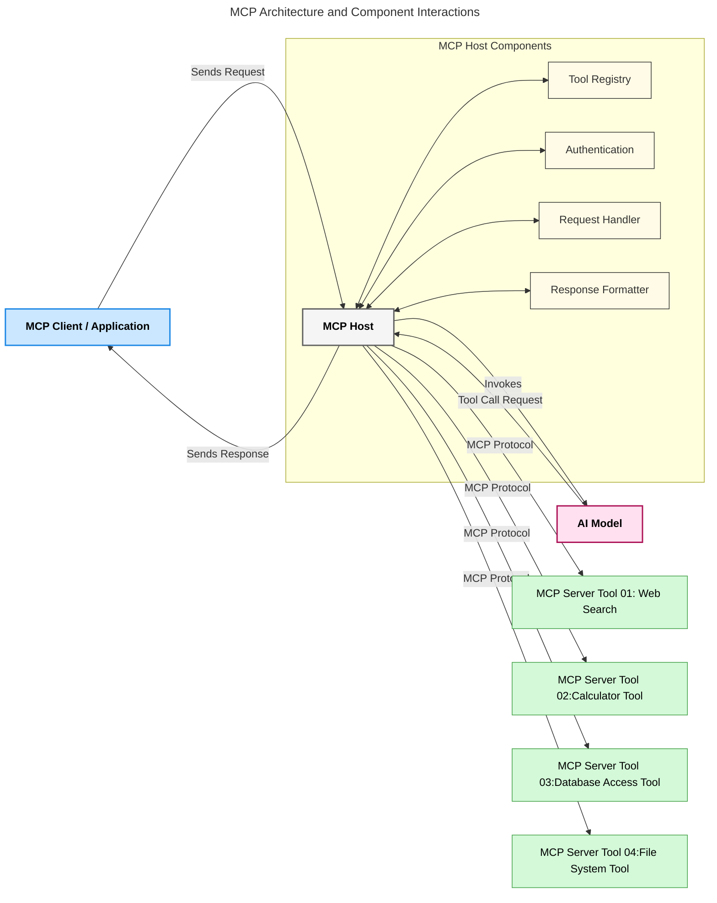
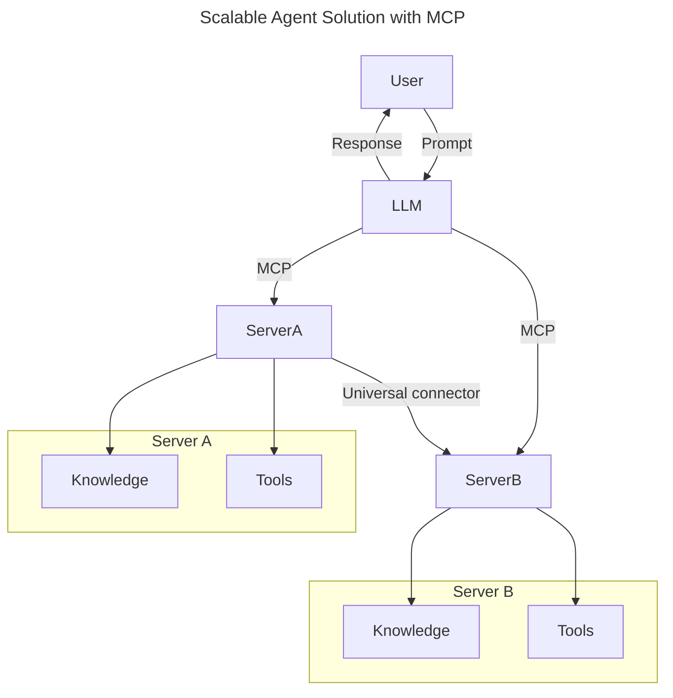
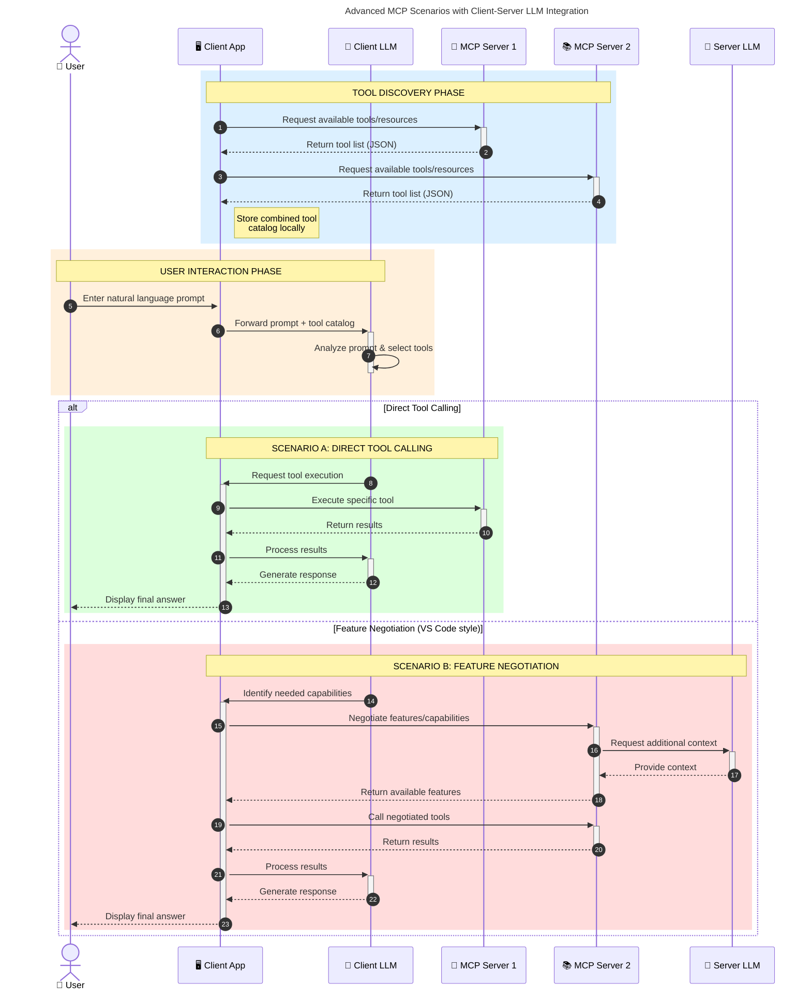

### What Is the Model Context Protocol (MCP)?
  * The **MCP** is an **open, standardized interface** that allows LLMs to interact seamlessly with external tools, APIs, and data sources. 
  * It provides a consistent architecture to enhance AI model functionality beyond their training data, enabling smarter, scalable, and more responsive AI systems.

### Why Standardization in AI Matters
  * As generative AI applications become more complex, it's essential to adopt standards that ensure **scalability, extensibility, maintainability,** and **avoiding vendor lock-in**. 
  * MCP addresses these needs by:
      1. Unifying model-tool integrations
      1. Reducing brittle, one-off custom solutions
      1. Allowing multiple models from different vendors to coexist within one ecosystem

### MCP Solves Fragmentation in AI Interactions
  * Before MCP, integrating models with tools required:
      1. Custom code per tool-model pair
      1. Non-standard APIs for each vendor
      1. Frequent breaks due to updates
      1. Poor scalability with more tools

### Benefits of MCP Standardization
| **Benefit**              | **Description**                                                                |
|--------------------------|--------------------------------------------------------------------------------|
| Interoperability         | LLMs work seamlessly with tools across different vendors                       |
| Consistency              | Uniform behavior across platforms and tools                                    |
| Reusability              | Tools built once can be used across projects and systems                       |
| Accelerated Development  | Reduce dev time by using standardized, plug-and-play interfaces                |

### High-Level MCP Architecture Overview
 * MCP follows a **client-server model**, where:
   1. **MCP Hosts** run the AI models
   1. **MCP Clients** initiate requests
   1. **MCP Servers** serve context, tools, and capabilities
 
 
 * Key Components:
   1. **Resources** – Static or dynamic data for models  
   1. **Prompts** – Predefined workflows for guided generation  
   1. **Tools** – Executable functions like search, calculations  
   1. **Sampling** – Agentic behavior via recursive interactions

### How MCP Servers Work
 * MCP servers operate in the following way:
    1. **Request Flow**:
       * 1 A request is initiated by an end user or software acting on their behalf.
       * 2 The **MCP Client** sends the request to an **MCP Host**, which manages the AI Model runtime.
       * 3 The **AI Model** receives the user prompt and may request access to external tools or data via one or more tool calls.
       * 4 The **MCP Host**, not the model directly, communicates with the appropriate **MCP Server(s)** using the standardized protocol.
    1. **MCP Host Functionality**:
       * **Tool Registry**: Maintains a catalog of available tools and their capabilities.
       * **Authentication**: Verifies permissions for tool access.
       * **Request Handler**: Processes incoming tool requests from the model.
       * **Response Formatter**: Structures tool outputs in a format the model can understand.
    1. **MCP Server Execution**:
       - The **MCP Host** routes tool calls to one or more **MCP Servers**, each exposing specialized functions (e.g., search, calculations, database queries).
       - The **MCP Servers** perform their respective operations and return results to the **MCP Host** in a consistent format.
       - The **MCP Host** formats and relays these results to the **AI Model**.
     1. **Response Completion**:
       - The **AI Model** incorporates the tool outputs into a final response.
       - The **MCP Host** sends this response back to the **MCP Client**, which delivers it to the end user or calling software.
  

### How to Build an MCP Server (With Examples)
 * MCP servers allow you to extend LLM capabilities by providing data and functionality. 
   1. **Python SDK**: https://github.com/modelcontextprotocol/python-sdk
   1. **TypeScript SDK**: https://github.com/modelcontextprotocol/typescript-sdk
   1. **Java SDK**: https://github.com/modelcontextprotocol/java-sdk
   1. **C#/.NET SDK**: https://github.com/modelcontextprotocol/csharp-sdk
  
### Real-World Use Cases for MCP
 * MCP enables a wide range of applications by extending AI capabilities:
   
| **Application**              | **Description**                                                                |
|------------------------------|--------------------------------------------------------------------------------|
| Enterprise Data Integration  | Connect LLMs to databases, CRMs, or internal tools                             |
| Agentic AI Systems           | Enable autonomous agents with tool access and decision-making workflows        |
| Multi-modal Applications     | Combine text, image, and audio tools within a single unified AI app            |
| Real-time Data Integration   | Bring live data into AI interactions for more accurate, current outputs        |

 

### Facilitates access to knowledge
 * Beyond offering tools, MCP also facilitates access to knowledge.
    1. It enables applications to provide context to LLMs by linking them to various data sources.
    1. For instance, an MCP server might represent a company’s document repository, allowing agents to retrieve relevant information on demand.
    1. Another server could handle specific actions like sending emails or updating records.
    1. From the agent’s perspective, these are simply tools it can use—some tools return data (knowledge context), while others perform actions.
    1. MCP efficiently manages both.

 * An agent connecting to an MCP server automatically learns the server's available capabilities and accessible data through a standard format.
    1. This standardization enables dynamic tool availability.
    2. For example, adding a new MCP server to an agent’s system makes its functions immediately usable without requiring further customization of the agent's instructions.

 * This streamlined integration aligns with the flow depicted in the following diagram, where servers provide both tools and knowledge, ensuring seamless collaboration across systems. 

### Example: Scalable Agent Solution
  * The Universal Connector enables MCP servers to communicate and share capabilities with each other, allowing ServerA to delegate tasks to ServerB or access its tools and knowledge.
  * This federates tools and data across servers, supporting scalable and modular agent architectures.
  * Because MCP standardizes tool exposure, agents can dynamically discover and route requests between servers without hardcoded integrations.
  * Tool and knowledge federation: Tools and data can be accessed across servers, enabling more scalable and modular agentic architectures.

### Advanced MCP Scenarios with Client-Side LLM Integration
 * Beyond the basic MCP architecture, there are advanced scenarios where both client and server contain LLMs, enabling more sophisticated interactions.
 * In the following diagram, **Client App** could be an IDE with a number of MCP tools available for user by the LLM:

## Practical Benefits of MCP
 * Here are the practical benefits of using MCP:
   - **Freshness**: Models can access up-to-date information beyond their training data
   - **Capability Extension**: Models can leverage specialized tools for tasks they weren't trained for
   - **Reduced Hallucinations**: External data sources provide factual grounding
   - **Privacy**: Sensitive data can stay within secure environments instead of being embedded in prompts
