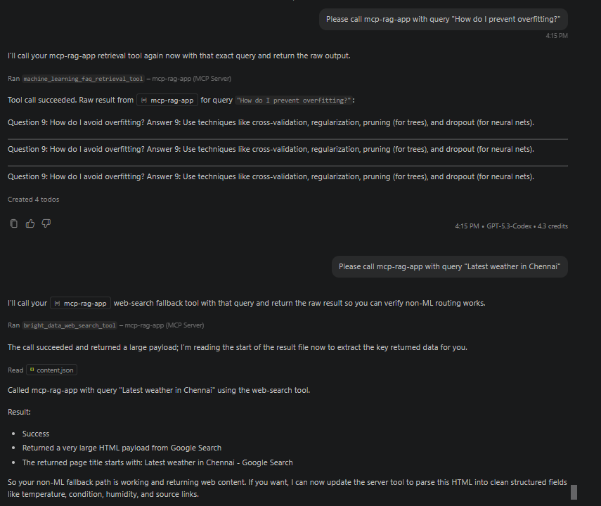
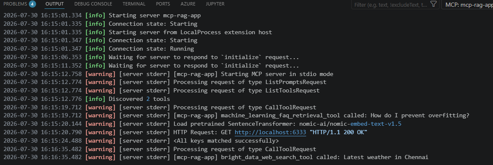
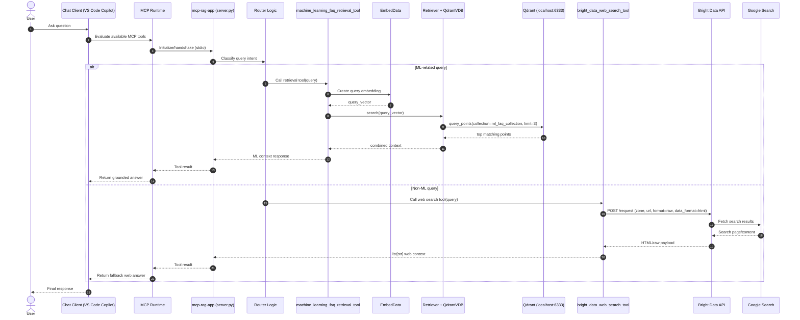

1. Get BrightData API Key -  brightdata.com -> create a new "SERP API" -> Store it in the .env file.

2. compile ``` python -m py_compile server.py rag_code.py ```

3. install dependency ``` python -m pip install -r requirements.txt ```

4. start a Qdrant docker container
   ```bash
   docker run -p 6333:6333 -p 6334:6334 -v $(pwd)/qdrant_storage:/qdrant/storage:z qdrant/qdrant

   docker run -d --name qdrant -p 6333:6333 -p 6334:6334 -v "${PWD}/qdrant_storage:/qdrant/storage" qdrant/qdrant
   ```

5. Run Project  - go to the notebook.ipynb file, run the code to create a collection in your vector database.

6. Finally, set up your local MCP server as follows : Go to Cursor IDE settings -> Select MCP -> Add new global MCP server -> add this:
    ```json
    {
    "mcpServers": {
        "mcp-rag-app": {
            "command": "python",
            "args": ["/absolute/path/to/server.py"],
            "host": "127.0.0.1",
            "port": 8080,
            "timeout": 30000
        }
    }
    }
    ```

7. OR you can do it through VSC, start server

    ``` 
    {
        "servers": {
            "mcp-rag-app": {
                "type": "stdio",
                "command": "C:/mcp/.venv/Scripts/python.exe",
                "args": ["C:/mcp/usecase_02/server.py"]
            }
        },
        "inputs": []
    }
    ```
    - Please call mcp-rag-app with query "How do I prevent overfitting?"
    - Please call mcp-rag-app with query "Latest weather in Chennai"

    

7. now interact with your vector database and fallback to web search if needed.
    
    

