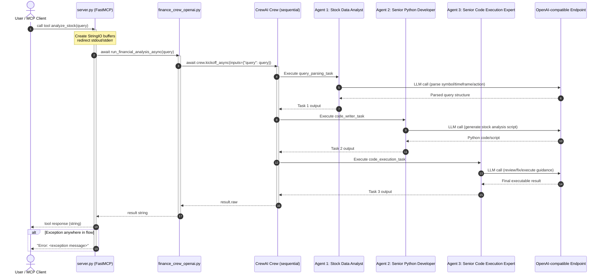

* building-financial-analyst-azure-openai.ipynb - very fast, it can be done 14s, compare to local deepstack-r1 it take minimum 1 hr

1. compile
python -m py_compile server.py finance_crew.py

2. install dependency
python -m pip install -r requirements.txt

3. Download model
ollama run deepseek-r1

4. Run the project, set up your MCP server : Cursor settings -> MCP -> add new global MCP server -> JSON file

```
{
    "mcpServers": {
        "financial-analyst": {
         "command": "uv",
            "args": [
                "--directory",
                "absolute/path/to/project_root",
                "run",
                "server.py"
            ]
        }
    }
}
```

- Cursor MCP settings -> toggle the button to connect the server to the host.

- chat with Cursor and analyze stock market data. 
- Simply provide the stock symbol and timeframe you want to analyze, and watch the magic unfold.

- Example queries:
    - "Show me Tesla's stock performance over the last 3 months"
    - "Compare Apple and Microsoft stocks for the past year"
    - "Analyze the trading volume of Amazon stock for the last month"

7. OR you can do it through VSC, start server

    ``` 
    {
        "servers": {
           "mcp-finance-app": {
                "type": "stdio",
                "command": "C:/mcp/.venv/Scripts/python.exe",
                "args": ["C:/mcp/usecase_03/server.py"]
		    }
        },
        "inputs": []
    }
    ```
    - Please call mcp-rag-app with query "Plot YTD stock gain of Tesla""


