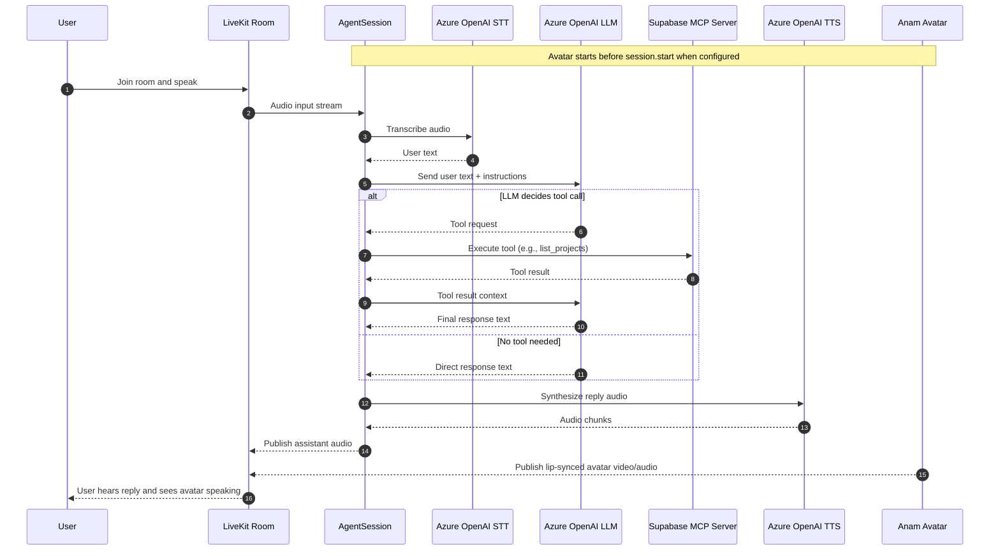

* https://docs.livekit.io/agents/
* https://lab.anam.ai/api-keys - avatar
1. install ``` python -m pip install -r requirements.txt ```
2. Implementation: agent.py - This implementation uses AssemblyAI's services for speech-to-text, along with Firecrawl for web search and Supabase for database operations.
  - Requirements
      - Firecrawl API key
      - Supabase access token
      - OpenAI API key
      - AssemblyAI API key
      - LiveKit credentials

3. `.env` and configure the following environment variables:
  ```
  FIRECRAWL_API_KEY=your_firecrawl_api_key
  SUPABASE_ACCESS_TOKEN=your_supabase_token
  OPENAI_API_KEY=your_openai_api_key
  ASSEMBLYAI_API_KEY=your_assemblyai_api_key
  LIVEKIT_URL=your_livekit_url
  LIVEKIT_API_KEY=your_livekit_api_key
  LIVEKIT_API_SECRET=your_livekit_api_secret
  ```

  

4. Running
    - ``` python agent.py console``` - speak through vsc.
    - The agent will:
      1. Connect to LiveKit
      2. Initialize the MCP server for Supabase integration
      3. Set up voice interaction capabilities
      4. Start listening for user input

    

    - inference quota exceeded, use openai llm

     

6. Features
    - Real-time web search using Firecrawl
    - Supabase database integration via MCP
    - Voice interaction capabilities:
      - Silero VAD (Voice Activity Detection)
      - AssemblyAI Speech-to-Text
      - OpenAI GPT-4 for language processing
      - OpenAI TTS for text-to-speech
     
* Difference between assemblyai & inference
  - Short answer: they use different backends and billing paths.
  - assemblyai.STT(...)
      - Sends audio directly to AssemblyAI.
      - You pay/use your AssemblyAI account and API key.
      - You get AssemblyAI-specific features and params (like keyterms_prompt).
      - Behavior, accuracy tuning, and limits follow AssemblyAI.
  - inference.STT(model="deepgram/nova-3", language="multi")
      - Sends audio through LiveKit Inference, which routes to the provider model (here Deepgram Nova-3).
      - You use LiveKit Inference quota/billing (not direct provider credentials in this call style).
      - Easier unified setup across providers, but you can hit LiveKit Inference quota/rate limits.
      - Provider-specific knobs may be less direct than using provider SDK/plugin directly.


