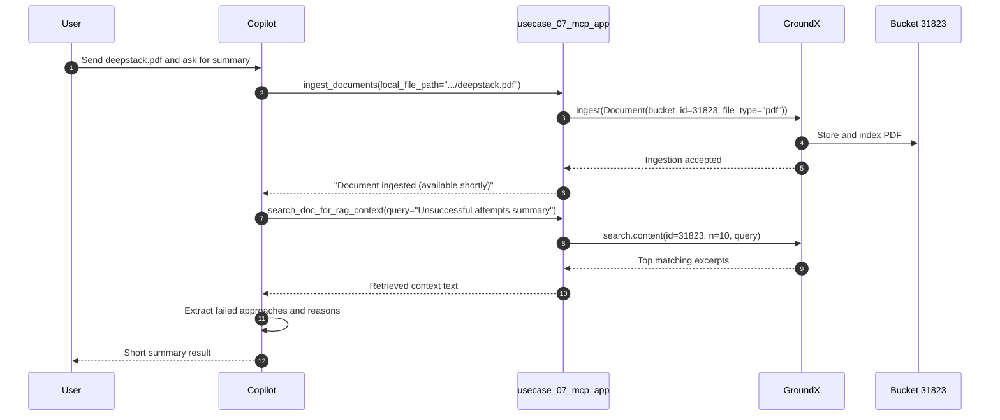

* create bucket get bucket id, pass it code
    

    

* Install
  ```
  usecase_07> uv sync
  usecase_07> python -m pip install -e .
  
  # usecase_07/.venv folder in local project fodler
  python -m venv .venv
  venv\Scripts\activate
  pip install "mcp[cli]"
  ```
* .env - GROUNDX_AI_API_KEY=aasdasdasdasdase

* mcp.json
  ```
  		"usecase_07_mcp_app": {
			"type": "stdio",
			"command": "C:/usecase_07/.venv/Scripts/python.exe",
			"args": ["C:/usecase_07/server.py"]
		},
  ```

     

    

    

    
    

* mcp tool run ``` npx @modelcontextprotocol/inspector@latest  mcp run server.py  ```

* New MCP Server
  - Server
    

  - Tools

    
    

  - Prompts
    
    

  - Resources
    
      

* Ingest file
  
    

    

* search
  
    

    



