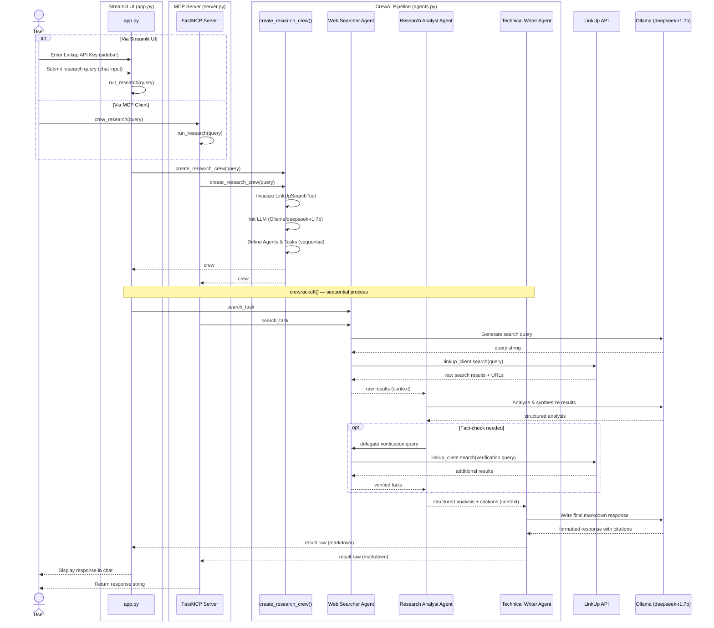

```
ollama pull deepseek-r1:7b 
cd C:\usecase_09 ``

python -m venv .venv

.\.venv\Scripts\Activate.ps1

python -m pip install crewai streamlit python-dotenv linkup pydantic

python -m streamlit run app.py

python agents_test.py 

```

