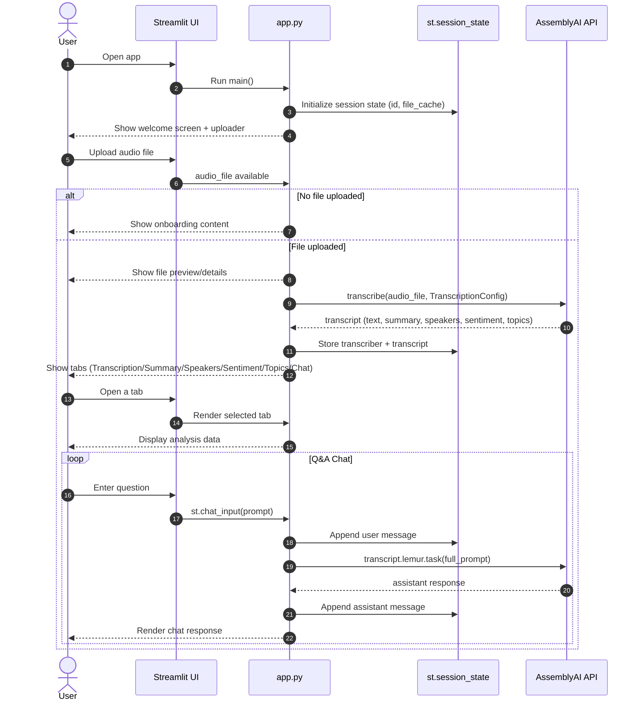

```
1. Install uv

# MacOS/Linux
curl -LsSf https://astral.sh/uv/install.sh | sh

# Windows
powershell -ExecutionPolicy ByPass -c "irm https://astral.sh/uv/install.ps1 | iex"

2. create env
uv init project-name
cd project-name

# Create virtual environment and activate it
uv venv
source .venv/bin/activate  # MacOS/Linux

.venv\Scripts\activate     # Windows

3. Install dependencies
uv sync

4. .env
RAGIE_API_KEY=your_ragie_api_key

5. Run the project -> Cursor settings -> seleect MCP Tools -> Add new global MCP server - json
{
    "mcpServers": {
        "ragie": {
            "command": "uv",
            "args": [
                "--directory",
                "/absolute/path/to/project_root",
                "run",
                "server.py"
            ],
            "env": {
                "RAGIE_API_KEY": "YOUR_RAGIE_API_KEY"
            }
        }
    }
}
```





