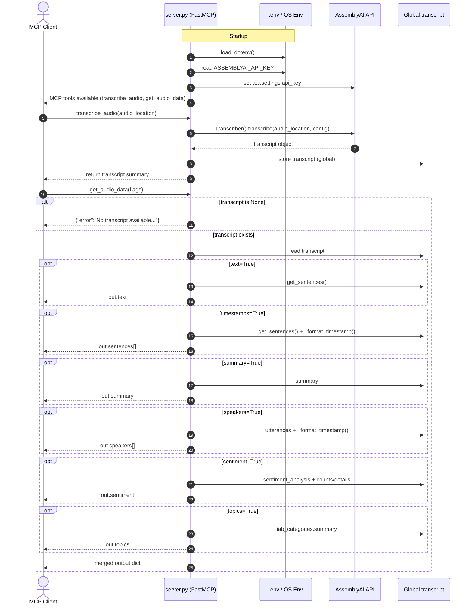

```
cd usecase_11

# Create a virtual environment
python -m venv .venv

# Activate the virtual environment
# MacOS/Linux
source .venv/bin/activate

# Windows
.venv\Scripts\activate

# Install dependencies
pip install -r requirements.txt

.env
ASSEMBLYAI_API_KEY=your_assemblyai_api_key

1. Run as a Streamlit App (Interactive UI)
streamlit run app.py

2. Run as an MCP Server (for Cursor/Agent Integration)
{
    "mcpServers": {
        "assemblyai": {
            "command": "python",
            "args": [
                "server.py"
            ],
            "env": {
                "ASSEMBLYAI_API_KEY": "YOUR_ASSEMBLYAI_API_KEY"
            }
        }
    }
}
```

